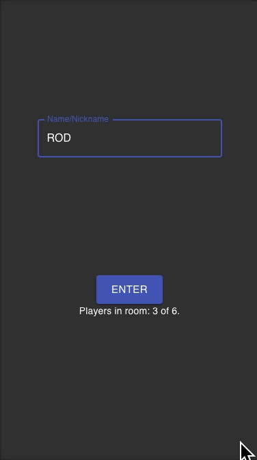
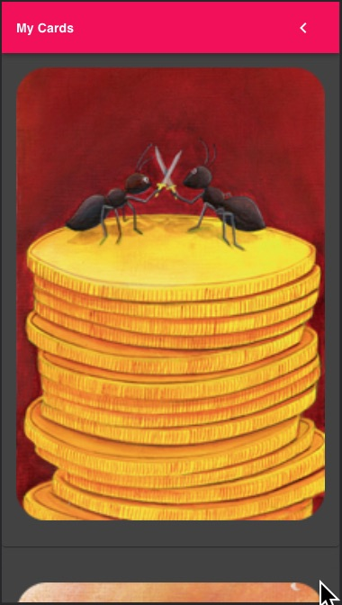
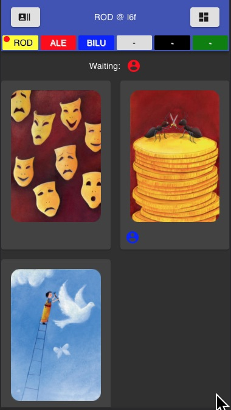

# React DiXit Game

This is an adaptation of the board game Dixit to the web mobile plataform. 

## Motivation 

* To continue playing DiXit with my friends and family during the quarantine period of the COVID-19.
* Another motivation is to put in practice some _React_ development skills. 

## Disclaimer

This is a study project and improvents are required in many ways.

## Demo

https://rodrigolop.es/dixit

## Dev Stack

React, Redux, Webpack, Websockts and MaterialUI.

## TODO

* [ ] Add progress to score board
* [ ] Sum score immediately after round is finished
* [ ] Recover last username (use localStore)
* [ ] Segregate componets/pages
* [x] Resolve concurrency problem (two players send a new state at same time)
* [x] SSL
* [x] Deny new players after game has started
* [x] Internationalize game texts
* [x] Add prettier plugin
* [x] Change white color to grey
* [x] Show those that haven't voted yet
* [x] Implement end of match condition
* [x] Deal with no more players allowed in the room (max limit)
* [x] Detect websocket disconnection and reconnect
* [x] Remove button to cast vote for your own card
* [x] Deploy
* [x] Highlight story teller card after reveal
